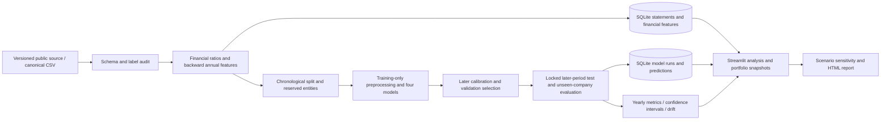

# Credit Risk Assessment & Default Prediction System

An educational financial analytics system for financial-statement analysis, bankruptcy-risk estimation, model validation, company histories, portfolio snapshots and scenario reporting.

The project now has a **chronological annual-panel experiment** and a separate **Polish five-year baseline**. The annual experiment tests transfer to later fiscal years and to companies excluded from development. It does not claim that a model generalizes to every borrower or country.

## What it includes

- Versioned public-source ingestion, schema validation, checksum verification and a target-label audit.
- SQLite entities, annual financial statements, derived ratios, model runs, grades and predictions.
- Dimensionless financial ratios, consecutive-year lags and annual changes.
- Logistic regression, decision tree, random forest and gradient boosting.
- Separate chronological training, probability calibration, validation and final test periods.
- Earlier walk-forward diagnostics, reserved unseen-company evaluation and entity-cluster confidence intervals.
- Calibration, constant-probability baselines, annual performance, feature drift and model explanations.
- Streamlit portfolio/company/validation views, new-CSV scoring and downloadable HTML reports.
- Explicit income-statement scenario assumptions and honest missing-data limitations.

## Dataset and target

The annual panel comes from the [authors' public dataset repository](https://github.com/sowide/bankruptcy_dataset), pinned to its original 2022 release. It contains 78,682 annual rows, 8,971 anonymous entities and fiscal years 1999–2018. Source attribution: Lombardo et al. (2022), [dataset paper](https://doi.org/10.3390/fi14080244), CC BY 4.0.

The source's failure status repeats across an entity's historical records. The adapter reconstructs the annual event label from the final financial year of failed entities and checks all 20 annual event counts against the paper. **Exact bankruptcy and filing-publication dates are unavailable.** The output is a reconstructed next-fiscal-year bankruptcy probability proxy. [Methodology and source audit](docs/temporal_methodology.md) explain this material limitation.

The [original Polish dataset](docs/data_dictionary.md) provides 64 ratios and a five-year bankruptcy label but no dates or persistent company IDs. Its random-split results remain available under the separate dashboard selector. Its `1year` file must not be treated as a calendar year or a one-year PD.

## Reproduce the annual experiment

The recorded environment uses Python 3.14.2, specified in `.python-version`; the package environment is recorded in `requirements.lock.txt` and each generated model card. Check `python3 --version` before creating the environment, and use Python 3.14 for the closest reproduction.

From the project directory:

```bash
python3 -m venv .venv
source .venv/bin/activate
python -m pip install -r requirements.lock.txt
python scripts/prepare_temporal_dataset.py
python scripts/run_temporal_pipeline.py
PYTHONPATH=src python -m unittest discover -s tests -v
streamlit run dashboard/app.py
```

The first preparation command requires internet access; it reuses the pinned local file on subsequent runs. Training never downloads or calls an external scoring service. Data, models, local databases and generated report artifacts are excluded from Git and regenerated by these commands.

If the environment already exists, run the two temporal scripts and restart or refresh the dashboard. Select **Annual panel — chronological validation** in the sidebar. The **Temporal Validation** page exposes the actual results and limitations.

## Chronological methodology

| Stage | Fiscal years | Role |
| --- | --- | --- |
| Training | 1999–2007 | Fit financial-feature preprocessing and models |
| Calibration | 2009–2010 | Fit probability calibration on a later period |
| Validation | 2012–2013 | Choose model, probability output and decision threshold |
| Final test | 2015–2018 | Evaluate locked choices |

A full-year gap between stages allows prior annual outcomes to mature. Approximately 20% of anonymous entity IDs are reserved from every development stage. Final results distinguish reserved unseen entities, naturally new entities, and entities observed in development. Earlier walk-forward diagnostics also repeat the full development process.

## Results

Read [generated chronological results](docs/temporal_results.md) for the real model comparison, final metrics, annual/cohort breakdowns and confidence intervals. It is regenerated from the run artifacts, rather than populated with illustrative results. The dashboard displays the same run, and checks that database and model identifiers agree.

[Legacy Polish results](docs/model_results.md) are a separate experiment with a different population and horizon, so their metrics are not directly comparable.

The [interview guide](docs/interview_guide.md) explains the financial decisions, source-label audit, temporal evaluation and remaining limitations in plain language.

## Repository checks

The GitHub Actions workflow runs the existing unit tests and checks dependency consistency on pushes to `main` and on pull requests. These checks cover ingestion, ratio edge cases, grade boundaries, model serialization, past-only features, entity reservation and chronological split rules. Test fixtures are artificial inputs used only to check software behavior; published performance results come from the public datasets.

Downloaded data, fitted model files and local databases are rebuilt using the reproduction commands. The Python model implementation in `src/credit_risk/models/` is included in Git. The tests do not download datasets or retrain the full historical experiments.

See [publishing and demonstration instructions](docs/github_guide.md) for creating the GitHub repository and presenting the project.

## Score another dataset

Map additional annual statements into the documented canonical field names. Download an empty CSV header from **Score New CSV**, or use the schema in [the methodology](docs/temporal_methodology.md). Target labels are not required for prediction.

```bash
python scripts/score_panel_csv.py path/to/annual_statements.csv --output outputs/scored_panel.csv
```

Preserve real company IDs and fiscal years, use a consistent monetary scale within each row, and include available earlier years. Missing values remain missing. The output includes indicators for missing features and values outside training reference ranges. Scoring a new dataset does not itself validate transfer to that population.

## Financial interpretation

Liquidity measures near-term resources relative to obligations. Liability and long-term-debt ratios describe capital structure. Earnings margins, returns, and their changes describe profitability. Ratios depend on the business model, accounting definitions and financial context. Negative/zero equity and EBITDA need explicit treatment. Observed operating cash flow, interest expense, total debt and debt-maturity schedules are unavailable in this source.

PD is the modeled probability for a defined event and horizon. Expected loss is conventionally `PD × LGD × EAD`, where LGD is the loss fraction conditional on default and EAD is exposure at default. This dataset supplies neither LGD nor EAD, so the displayed portfolio summaries are not exposure-weighted expected loss estimates.

## Architecture



Code is separated into ingestion, financial analysis/features, models, evaluation, database, stress testing, reporting and dashboard modules. See [the original phased architecture](docs/architecture.md) for the development history and initial scope.

## Limitations and future work

- Fiscal-year chronology is established, but point-in-time statement availability and exact individual event dates are not verified.
- Negative survival outcomes depend on the source convention; independent delisting/follow-up information is missing.
- Rare events produce uncertain cohort and annual metrics. Threshold performance and calibration must be read with these counts.
- Listed-company data from 1999–2018 do not establish suitability for current conditions, private borrowers or other regions.
- Internal grades and the classification threshold are transparent project assumptions. They do not represent an external methodology, regulatory approval or lending policy.
- Scenario results are model sensitivities under explicit accounting assumptions, without full financing or balance-sheet feedback.
- Next steps require independently dated outcomes, filing availability, external population validation, and observed exposure/loss information.

## Legacy pipeline

```bash
python scripts/prepare_dataset.py
python scripts/load_sqlite.py
python scripts/summarize_financial_metrics.py
python scripts/train_models.py
```

These commands preserve the separate original experiment. See [its financial guide](docs/financial_analysis.md) and [its modeling methodology](docs/modeling_methodology.md).
