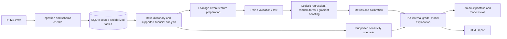

# Credit Risk Assessment & Default Prediction System

> This document preserves the original 10–15 hour scope. The subsequent annual-panel extension supersedes its single-source and random-split constraints. See [the current architecture](../README.md#architecture), [chronological methodology](temporal_methodology.md), and [generated results](temporal_results.md). The annual extension adds genuine fiscal-year ordering, persistent entity keys, past-only financial history, later-period calibration, and reserved unseen-company evaluation. Exact filing dates remain unavailable.

## MVP architecture and delivery plan

This repository is scoped to a complete, explainable student MVP that can be built in approximately 10–15 focused hours. It is not intended to implement every advanced feature in the original full specification.

## What the MVP will deliver

- One public, labeled company-distress dataset and one documented prediction horizon.
- CSV ingestion, schema checks, a reproducible SQLite load, and a compact data dictionary.
- Financial ratio categorization and interpretation for the fields available in the chosen dataset.
- Leakage-aware feature preparation and a train/validation/test workflow.
- Three scikit-learn models: logistic regression, random forest, and gradient boosting.
- ROC-AUC, PR-AUC, recall, precision, confusion matrix, Brier score, and a calibration plot; accuracy is supplementary.
- Calibrated PD if validation data supports calibration; otherwise clearly labeled raw model PD and a calibration limitation.
- A transparent **Project Internal Credit Risk Rating** mapping and model-based feature explanations.
- A small Streamlit dashboard with Portfolio and Model tabs, plus company/row-level detail.
- One documented sensitivity scenario, only for input fields that the dataset actually supports.
- A downloadable HTML company/observation report and interview-focused README.

The output is educational and is not an external rating, real lending recommendation, regulatory model, or credit approval.

For this selected source, the observed label is bankruptcy within five years. Any PD-like output must be described as a model estimate against that bankruptcy proxy, not as an empirically observed contractual default probability.

## Deliberate scope cuts for the 10–15 hour target

- No SEC/XBRL ingestion, source matching, or multi-dataset joins.
- No attempt to invent raw revenue, EBITDA, debt balances, named companies, sector, EAD, or LGD where the selected dataset does not provide them.
- No exposure-weighted expected loss unless reliable EAD and LGD data are present. Otherwise the dashboard will show PD summaries only.
- No full SHAP integration, hyperparameter search, model registry, PostgreSQL, authentication, deployment, or PDF layout work.
- No multi-scenario stress engine. A ratio-level sensitivity, if supported and clearly labeled, is not represented as a full financial statement stress test.
- No separate notebook project. The pipeline and app remain in reusable Python modules.

## Initial dataset direction and caveat

Selected starting point: the **1st-year case** from the UCI Polish companies bankruptcy dataset. UCI describes this case as financial rates from the first year with a bankruptcy outcome over the following five years; it reports 7,027 observations and 271 bankrupt firms. The dataset has 64 financial ratios and missing values and is licensed CC BY 4.0. [UCI dataset documentation](https://archive.ics.uci.edu/dataset/365/polish+companies+bankruptcy+data)

This is a practical labeled modeling source, but it is not a complete feed of raw financial statement line items or identified counterparties. Therefore:

- The main modeling demonstration will use the supplied ratios and future bankruptcy label.
- Liquidity, leverage, profitability, coverage, and cash-flow analysis will use only ratios that are documented in the dataset.
- Ratio formulas will be explained; the project will not claim to recompute ratios from unavailable raw statement amounts.
- Dataset rows will be treated as anonymous observations. Do not call them named companies or show sector concentration unless those fields are confirmed in the data.
- Phase 2 verified the archive, 64 ratio columns, five-year target, CC BY 4.0 license, and missingness. The selected file has no date or stable company key, so it cannot support a time-aware or company-grouped holdout; validation will document this limitation.

## Architecture



## Repository layout

```text
credit-risk-system/
├── data/
│   ├── raw/                 # local source CSV; never committed
│   └── processed/           # reproducible local outputs; never committed
├── dashboard/
│   └── app.py               # Streamlit portfolio, observation, stress, and model pages
├── docs/
│   ├── architecture.md
│   ├── data_dictionary.md   # Phase 2
│   └── interview_guide.md   # final documentation phase
├── reports/                 # local generated reports; never committed
├── scripts/
│   ├── prepare_dataset.py   # download and convert source ARFF to CSV
│   ├── load_sqlite.py       # validate CSV and load/query SQLite
│   └── summarize_financial_metrics.py # calculate supported metric distributions
├── src/credit_risk/
│   ├── ingestion/
│   ├── financial_analysis/
│   ├── features/
│   ├── models/
│   ├── evaluation/
│   ├── portfolio/
│   ├── stress_testing/
│   └── reporting/
├── tests/                   # ingestion, financial metric, grade, and model smoke tests
├── .gitignore
├── README.md
└── requirements.txt
```

## Data flow and storage

1. Ingestion reads the source CSV, validates expected columns and types, and records rejected rows or warnings.
2. Canonical records preserve source row identity, feature values, outcome, and horizon. An anonymous row ID is a technical key, not a real company identity.
3. SQLite stores source observations, computed/supporting ratios, model run metadata, predictions, risk grades, and any explicitly assumed portfolio inputs.
4. Python functions retrieve data through a small SQL repository layer. The dashboard does not contain separate copies of modeling logic.
5. Models are persisted as reproducible local artifacts; data, SQLite files, and model binaries are excluded from Git.

## Validation rules

- Set a prediction horizon before training and keep the future bankruptcy label out of the feature matrix.
- Use a time-aware split only if valid observation dates exist. If not, document the available split design and its limits; group by company only if persistent company identifiers exist.
- Fit imputers, scalers, feature selection, and any resampling on training data only.
- Use validation data for model choice and calibration decisions. Use the test set once for final out-of-sample reporting.
- Report PR-AUC and recall alongside ROC-AUC because defaults are rare. Report Brier score/calibration because PD is a probability, not just a ranking.
- Treat feature attributions as model associations, not causal explanations.

## 10–15 hour build budget

| Phase | Target time | MVP result |
|---|---:|---|
| 1. Architecture | 0.5–1 hour | This architecture, folder layout, Git/GitHub setup |
| 2. Data pipeline | 1.5–2 hours | One CSV source, schema checks, SQLite load, data dictionary |
| 3. Financial calculations | 1.5–2 hours | Ratio mapping, supported calculations/interpretation, missing-value handling |
| 4. Models | 3–4 hours | Features, three models, comparison, calibration attempt, internal grade, explanations |
| 5. Testing | 1–1.5 hours | Focused checks for data, ratio edge cases, and leakage-sensitive pipeline behavior |
| 6. Dashboard | 2–3 hours | Portfolio/model views, individual observation detail, one supported sensitivity view, HTML report |
| 7. Final review | 1–1.5 hours | README, reproducible setup, limitations, GitHub-ready review |

This estimate assumes a working Python environment, one dataset that is readily downloadable and documented, and focused build sessions. If data access, package setup, or debugging takes longer, keep the core model and dashboard and drop the sensitivity view first.

## How you will work on it

- **Where:** this project folder is the working copy. `src/credit_risk/` is where reusable logic goes; `dashboard/app.py` is the UI; `docs/` is for explanations; `data/raw/` is only for local downloaded data.
- **How:** use a terminal opened at the project folder to run setup and pipeline commands. Edit source files in your code editor. Run and inspect one phase at a time.
- **GitHub:** create an empty private GitHub repository. After `.gitignore` exists, initialize Git here and push the architecture commit. Commit each approved phase with a short message. Make the repository public only after reviewing source terms and confirming no raw data, database, credentials, or local model files were committed.
- **Approval:** we will stop after each phase for your review before moving to the next one. Phases 2–6 are implemented and ready for review before Phase 7 final review.
