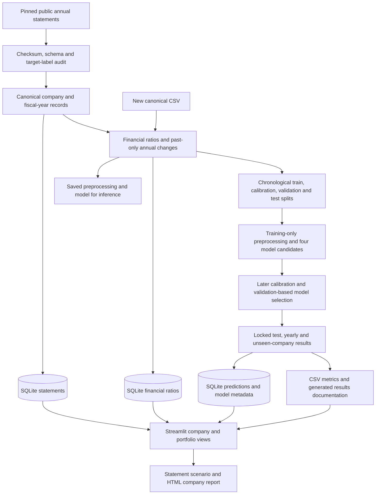

# System architecture

The main experiment uses an annual financial-statement panel. A separate Polish ratio-based experiment remains available as a baseline with a different population and five-year outcome horizon.

## Main pipeline

## Module responsibilities

| Location | Responsibility |
| --- | --- |
| `scripts/` | Command-line entry points for preparation, training, database loading, summaries and scoring |
| `src/credit_risk/ingestion/` | Canonical input validation and source-specific adapters |
| `src/credit_risk/financial_analysis/` | Definitions, availability and interpretation of the Polish source's supplied ratios |
| `src/credit_risk/features/` | Ratios from annual statements, backward lags, annual changes and training-fitted clipping |
| `src/credit_risk/models/` | Candidate models, calibration, training orchestration, scoring and project grades |
| `src/credit_risk/evaluation/` | Split rules, metrics, cluster bootstrap, calibration summaries and feature drift |
| `src/credit_risk/database/` | SQLite schemas, persistence, joins and retrieval |
| `src/credit_risk/explainability/` | Individual feature-to-training-median sensitivity explanations |
| `src/credit_risk/stress_testing/` | Annual income-statement operating-cost scenario |
| `src/credit_risk/reporting/` | Company HTML reports and results documentation generated from run artifacts |
| `dashboard/` | Dataset selection, portfolio aggregation, company views, scenarios and validation views |
| `config/` | Chronological split, entity reservation and reproducibility settings |
| `tests/` | Input, financial calculation, model persistence and leakage-control checks |
| `docs/` | Dataset definitions, methodology, generated results, architecture and demonstration guidance |

Portfolio aggregation currently lives in the dashboard functions. The annual view selects one fiscal year so a company is counted once in each snapshot.

## Storage and artifacts

The annual SQLite store contains `companies`, `financial_statements`, `financial_ratios`, `model_runs`, `risk_grades` and `model_predictions`. Statement keys identify a company and fiscal year. Predictions carry the model run identifier; the dashboard checks that the model bundle and database agree.

The annual database, fitted model and report tables live under `data/processed/`, `models/temporal/` and `reports/temporal/`. The Polish experiment uses separate artifacts. Raw sources, generated databases, model binaries and personal scoring outputs are excluded from Git. Small generated result summaries under `docs/` are versioned so repository readers can inspect actual results without running training.

The `.gitkeep` files preserve the expected empty data and report directories in a fresh clone. The root `.python-version` and `requirements.lock.txt` record the reproduction environment. `requirements.txt` lists direct dependencies; the lock file also records their installed dependencies.

## Information boundaries

- IDs and fiscal years identify records and define splits; they are not predictive features.
- Features use only the current and earlier statements of the same entity. Lags require consecutive fiscal years.
- Preprocessing and model fitting use training observations. Separate later periods fit calibration and select the model and decision threshold.
- Reserved entities are excluded from development; final results distinguish previously seen and unseen companies.
- Final test results are reported without tuning model choices against them.
- Exact filing-publication and individual bankruptcy dates are unavailable. Fiscal-year evaluation therefore does not establish a verified as-of-filing backtest.
- A saved model accepts new canonical statements, but scoring alone does not establish validity in another population.

See [annual methodology](temporal_methodology.md), [annual results](temporal_results.md), and [the separate Polish methodology](modeling_methodology.md) for detailed financial and statistical decisions.
